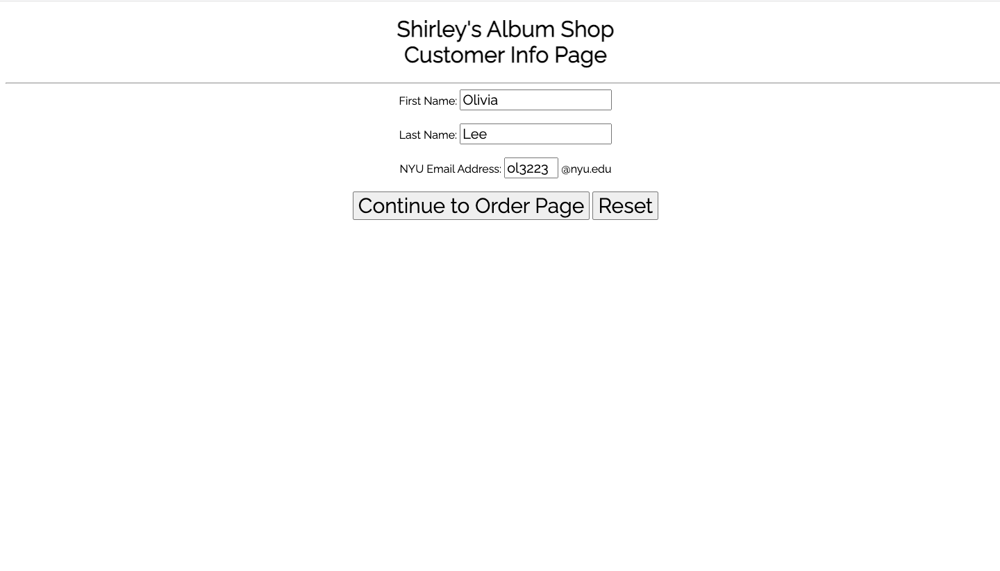
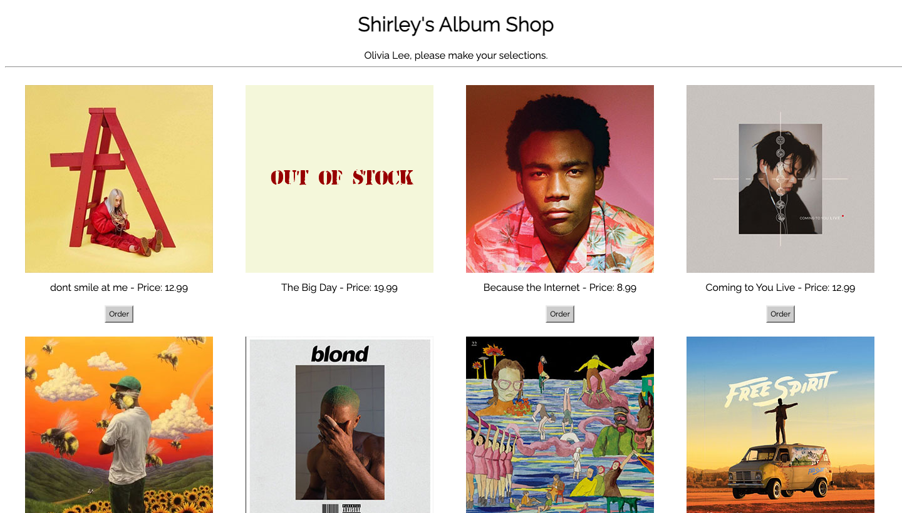
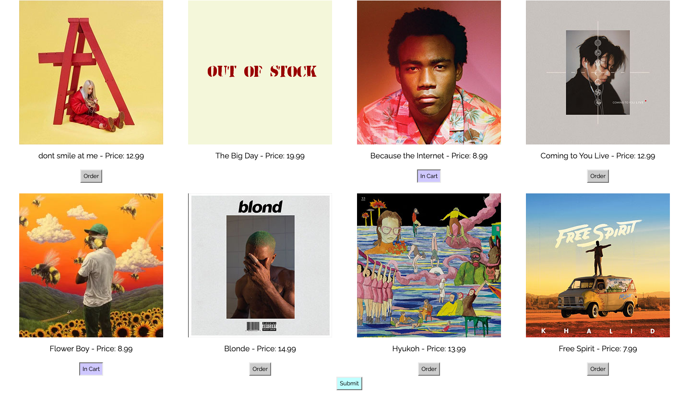
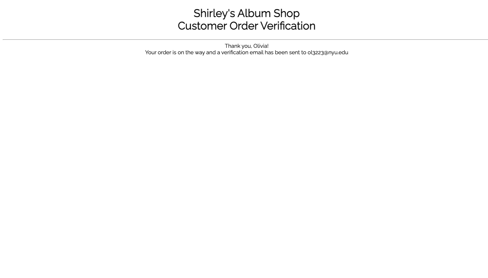

# Album Shopping Cart System

I built this album shopping cart system using HTML, PHP, JavaScript and JQuery. 

## Customer Information Page

The only entrance to the customer system is through the first page. In the first page, you merely collect your customer's information. Note that the Email address is ONLY an NYU ID which will restrict emailing to an NYU email address for security purposes.
If the customer presses "Continue" without entering legitimate info, an alert box should pop up instead.

## All Albums Page

The second screen is generated from the session cookies information and album_info file with stock information. Items out of stock will use an out of stock image generated by GD graphics. Order button is only generated if item is in stock and the buttons are created using jQuery.
### Selected Albums 

When the customer chooses the albums they want, the button will change from order to in cart. You can only order one copy of each item and an alert box pops up if you hit submit without ordering at least one item.

## Order Confirmation Page

When the customer hits "Submit" button, the order confirmation page is generated. It shows the totals and there are only two choices here: Hit Confirm, or abandon the whole order by closing the page and, hence, the session.

## Email Confirmation PAge

Several things happen when the customer hits confirm: The album stock file is updated, and an email detailing the complete order is created and sent to the NYU Email address.

Limitations to this project:
Updating credit card info, reordering stock automatically, generating shipping information but it implements many features of a shopping cart system.
